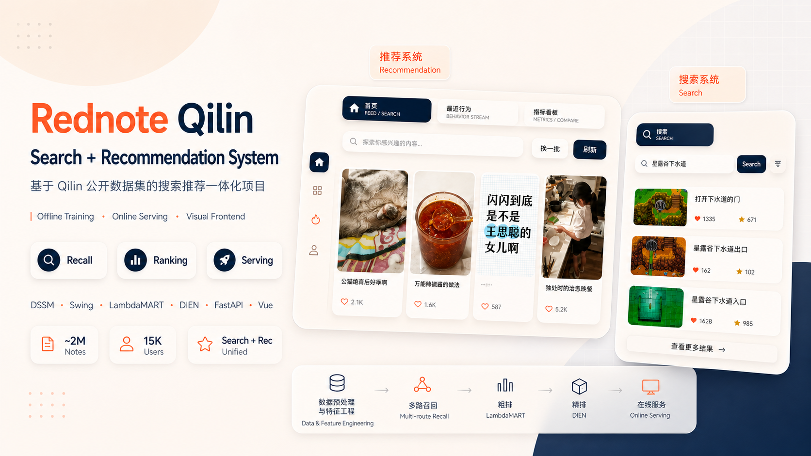

<div align="center">

[](./README.md)
[](./README_EN.md)

</div>
# 小红书麒麟(Qilin)搜推系统个人项目



Qilin 是一个面向“小红书搜索推荐一体化”场景的个人项目，采用接近业界主流搜推系统的三层架构：

- 离线层：样本构建、特征生成、召回/粗排/精排训练、索引构建、部署产物发布
- 在线层：FastAPI 服务、冷启动、召回、多路融合、粗排、精排、实时行为写回
- 前端层：Vue + Vite 可视化界面，覆盖首页、详情页、最近行为、指标看板

项目目标不是做一个单纯的模型脚本集合，而是把“离线训练 → 在线部署 → 页面验证 → 指标回放”串成一个完整闭环。

**项目视频展示链接：**  
- Bilibili: https://www.bilibili.com/video/BV1dDLm6qE9J/?share_source=copy_web&vd_source=e4fa524ab04ebed66f21b030503dfaaa  
- 小红书: https://www.xiaohongshu.com/explore/6a0d9df4000000003601c261?xsec_token=ABI5i6pPu-UkLbTQU14r4d7DGhMIrTiy-cbBKXE5coV1s=&xsec_source=pc_user

**机器配置参考：** GPU：5070 Ti 32GB显存，CPU：9700X 8核，内存：32GB（最重要），存储：固态硬盘 ~500GB。

## 0. 项目简介与成果

### 0.1 项目简介

Qilin 围绕小红书场景下的 **数据预处理 → 特征工程 → 召回 → 粗排 → 精排 → 在线服务** 主链路搭建。

- 数据规模
  - 笔记规模：`1,983,938 (~2M)`
  - 用户规模：`15,482`
- 搜索数据集（Search Dataset）
  - 训练集：`44,024` 条样本
  - 测试集：`6,192` 条样本
  - 特征：丰富的 Query 元数据、用户交互日志、点击标签真值
- 推荐数据集（Recommendation Dataset）
  - 训练集：`83,437` 条样本
  - 测试集：`11,115` 条样本
  - 特征：细粒度用户历史行为序列、候选笔记池、上下文特征、点击标签真值

### 0.2 项目成果

- 在线服务
  - 搜推系统线上服务延迟稳定在 `~150ms`
- Search 离线指标
  - 召回：`HitRate@500 = 0.88`，`Recall@500 = 0.65`，`MRR@100 = 0.11`，`MedianFirstHitRank = 47`
  - 排序：`NDCG@10 = 0.69`，`AUC = 0.77`，`GAUC = 0.85`
- Recommendation 离线指标
  - 召回：`HitRate@500 = 0.99`，`Recall@500 = 0.99`，`MRR@100 = 0.007`，`MedianFirstHitRank = 101`
  - 排序：`NDCG@10 = 0.87`，`AUC = 0.84`，`GAUC = 0.90`

### 0.3 核心流程

```text
数据预处理 / 特征工程
  → 召回训练与索引构建
    → DSSM 双塔
    → Swing
    → UserCF
    → Faiss IVFPQ
    → 多路召回融合
  → 粗排训练
    → LambdaMART (LightGBM + XGBoost)
  → 精排训练
    → DIEN
  → 部署产物发布
  → FastAPI 在线服务
  → Vue 前端验证与指标看板
```

## 1. 项目展示

### 1.1 推荐系统展示

<p align="center">
  
</p>

### 1.2 搜索系统展示

<p align="center">
  
</p>

### 1.3 离线指标展示

<p align="center">
  
</p>

### 1.4 样例对比展示

<p align="center">
  
</p>

## 2. 项目结构

### 2.1 根目录

```text
Qilin/
├─ datasets/
│  ├─ note_features/
│  ├─ recommendation_test/
│  ├─ recommendation_train/
│  ├─ search_test/
│  ├─ search_train/
│  └─ user_feat/
├─ features/
│  ├─ rec_test_features.parquet
│  ├─ rec_train_features.parquet
│  ├─ search_test_features.parquet
│  └─ search_train_features.parquet
├─ embeddings/
│  ├─ note_image_emb.parquet
│  ├─ note_text_emb.parquet
│  ├─ rec_query_emb.parquet
│  └─ search_query_emb.parquet
├─ gif/
├─ image/
├─ outputs/
│  ├─ data/
│  ├─ deploy/
│  │  ├─ rec/{easy,hard}/
│  │  └─ search/{easy,hard}/
│  ├─ index/
│  ├─ models/
│  ├─ results/
│  └─ serving_cache/
├─ src/
│  ├─ backend/
│  │  ├─ offline/
│  │  └─ online/
│  ├─ frontend/
│  │  ├─ src/
│  │  └─ dist/
│  ├─ preprocess/
│  ├─ recall/
│  └─ training/
├─ start.sh
├─ stop.sh
└─ README.md
```

说明：
- `datasets/`：原始训练/测试数据，包含 search / recommendation 两个场景请求、用户画像、笔记内容等
- `features/`：离线阶段生成的样本特征 parquet
- `embeddings/`：文本、图片、序列 embedding 存储目录
- `gif/`：README 演示 GIF 资源
- `image/`：笔记图片资源，在线接口 `/image/*` 直接读取
- `outputs/`：全部中间产物与部署产物，包括模型、索引、离线快照与最终 deploy 目录

### 2.2 后端 / 训练目录

```text
src/
├─ backend/
│  ├─ offline/
│  │  ├─ pipeline.py
│  │  ├─ storage/
│  │  └─ training/
│  └─ online/
│     ├─ api/
│     ├─ cold_start/
│     ├─ preranking/
│     ├─ ranking/
│     ├─ recall/
│     ├─ pipeline.py
│     └─ realtime_cache.py
├─ preprocess/
│  ├─ build_features.py
│  ├─ build_note_text_emb.py
│  ├─ build_query_text_emb.py
│  └─ build_samples.py
├─ recall/
│  ├─ build_multiroute_recall.py
│  ├─ build_seq_transition_index.py
│  ├─ dssm_trainer.py
│  └─ mine_hard_negatives.py
├─ training/
│  ├─ dien_ranker.py
│  ├─ ranker.py
│  └─ utils.py
└─ frontend/
   ├─ src/
   │  ├─ components/
   │  ├─ services/
   │  └─ views/
   └─ dist/
```

## 3. 系统架构

### 3.1 离线训练链路

```bash
uv run python src/backend/offline/pipeline.py --scene search
uv run python src/backend/offline/pipeline.py --scene rec
```

离线流程分为五个主阶段：
- `data`：构建 train / test 请求样本
- `feature`：生成模型训练所需特征与 embedding
- `training`：训练召回、multiroute、粗排、精排
- `deploy`：将离线产物发布到 `outputs/deploy/{scene}/{tag}`
- `feature-upload`：将用户画像与在线需要的实时特征写入 Redis

### 3.2 在线服务链路

```bash
uv run python src/backend/online/api/main.py
```

实际推荐链路在 `src/backend/online/pipeline.py` 中统一编排，整体流程为：
1. 解析用户与请求上下文
2. 冷启动判断
3. 召回
4. 粗排
5. 精排
6. 重排（去重 / 多样性处理）
7. 首页结果返回或详情页补查

### 3.3 前端交互链路

前端通过 `src/frontend/src/services/api.ts` 调用后端接口，核心页面行为包括：首页 feed、详情页交互、最近行为页、指标看板页。

## 4. 模型与分层

### 4.1 召回层

- DSSM ANN：双塔向量召回
- Swing：item-item 协同
- UserCF：user-user 协同
- Search 场景还会融合 request 级 lexical / semantic 结果

相关代码：
- `src/recall/dssm_trainer.py`
- `src/recall/build_multiroute_recall.py`
- `src/backend/online/recall/dssm.py`
- `src/backend/online/recall/service.py`

### 4.2 粗排层

粗排采用 GBDT 路线，负责压缩召回候选规模，并利用 query / user / note / linkage 特征快速排序。

### 4.3 精排层

精排采用 DIEN 路线，负责对粗排候选做更细的用户兴趣建模，并结合序列行为进一步重排。

## 5. Redis 的作用

### 5.1 Redis 是什么

Redis 是一个基于内存的键值数据库，适合存放低延迟、实时变化的在线状态数据。

### 5.2 Redis 在项目里存什么

- `qilin:user:{user_idx}:profile`：用户画像缓存
- `qilin:user:{user_idx}:{scene}:requests`：最近请求序列
- `qilin:user:{user_idx}:{scene}:history_notes`：最近历史 note 序列
- `qilin:user:{user_idx}:{scene}:behaviors`：最近行为事件流
- `qilin:user:{user_idx}:{scene}:exposed_notes`：最近曝光 note
- `qilin:{scene}:runtime_request_id`：在线 runtime request id 自增计数
- `qilin:dedup:*`：行为去重窗口 key

### 5.3 行为写入链路

前端行为入口在 `src/frontend/src/services/api.ts`，通过 `click / view / engage / deleteBehavior / deleteBehaviorsBatch` 进入 `src/backend/online/api/main.py`，再由 `src/backend/online/pipeline.py` 写入 `src/backend/online/realtime_cache.py`，最终同步到 Redis。

## 6. 部署产物与指标快照

在线服务真正加载的是：

```text
outputs/deploy/{scene}/{tag}/models
outputs/deploy/{scene}/{tag}/index
```

指标看板快照保存在：

```text
outputs/serving_cache/{scene}/{tag}/
```

---

<a id="english"></a>


